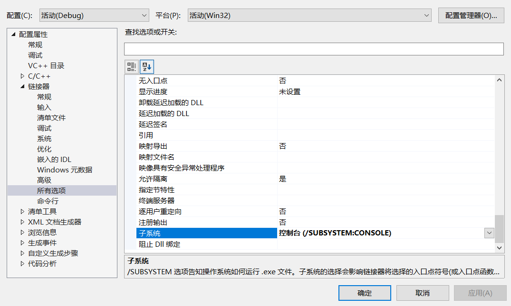
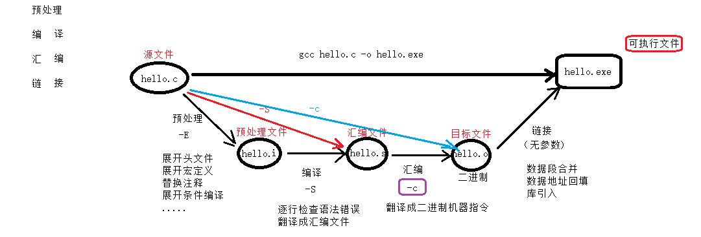
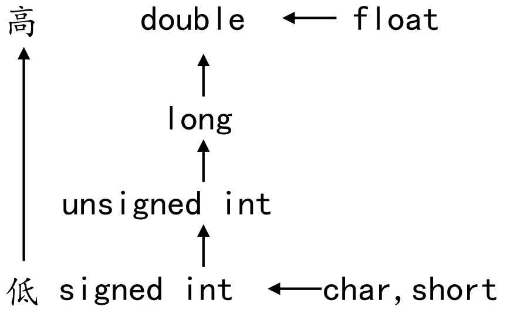

# day1

解决提示窗一闪而过：

```c
1. 通过 system()函数解决：

	在 return 0；之前添加 system("pause"); 
```

2. 借助VS工具解决：



单行注释：//	
	
多行注释：/* 注释内容 */ 

```c
多行注释不允许嵌套使用。 多行中可嵌套单行。
```

system 函数：

	执行系统命令。如： pause、cmd、calc、mspaint、notepad.....
	
	system("cmd");  system("calc");
	
	清屏命令：cls; system("cls");

**gcc编译4步骤：**



### 1. 预处理	-E	xxx.i	预处理文件

**gcc -E xxx.c -o xxx.i**

```c
	1) 头文件展开。 --- 不检查语法错误。 可以展开任意文件。

	2）宏定义替换。 --- 将宏名替换为宏值,宏函数替换。

	3）替换注释。	--- 变成空行

	4）展开条件编译 --- 根据条件来展开指令。
```
### 2.编译		-S	xxx.s	汇编文件

**gcc -S hello.i -o hello.s**

```c
	1）逐行检查语法错误。【重点】	--- 整个编译4步骤中最耗时的过程。

	2）将C程序翻译成 汇编指令，得到.s 汇编文件。
```
### 3.汇编		-c	xxx.o	目标文件

**gcc -c hello.s -o hello.o**

```c
翻译：将汇编指令翻译成对应的 二进制编码。
```
4. ### 链接		无	xxx.exe	可执行文件。

	**gcc  hello.o -o hello.exe**
```c
    1）数据段合并

	2）数据地址回填

	3）库引入
```

调试程序：

```c
添加行号：

	工具-->选项 --> 文本编辑器--> C/C++ -->行号 选中。

1. 设置断点。F5启动调试

2. 停止的位置，是尚未执行的指令。

3. 逐语句执行一下条 （F11）：进入函数内部，逐条执行跟踪。

3. 逐过程执行一下条 （F10）：不进入函数内部，逐条执行程序。

4. 添加监视：

	调试 --> 窗口 --> 监视：输入监视变量名。自动监视变量值的变化。
```

#  day2

### 常量：

不会变化的数据。不能被修改。

​    1. 字符常量、字符串常量 、数字常量(1,3.1415)

​    2. 宏常量  #define PI 3.1415   

​    3. 只读变量	const int a = 10; 定义语法：const 类型名 变量名 = 变量值。

​     const关键字： 被该关键字修饰的变量，表示为只读变量。

 

###  变量：

会变化的数据。能被修改。

​    定义语法：类型名 变量名 = 变量值。

​    变量三要素：类型、变量名、变量值。  


​    变量的声明：    

​      1) int a;    没有变量值的变量定义 叫做声明。

​      2）extern int a; 添加了关键字 extern。

 

1. 变量定义会开辟内存空间。变量声明不会开辟内存空间。

2. 变量要想使用必须有定义。


编译器编译程序时，在变量使用之前，必须要看到变量定义。如果没有看到变量定义，编译器会自动找寻一个变量声明提升为定义int 0。

 如果该变量的声明前有 extern 关键字，无法提升。


标识符：变量和常量的统称。

 

​    命名规则： 1. 通常常量使用大写、变量使用小写。大小写严格区分。

 

​           			2. 只能使用字母、数组、下划线（_）命名标识符。且，数字不能开头。 a-z/A-Z/0-9/_

 

​        		3. 禁止使用关键字和系统函数作为标识符名称。 main/system/printf/sleep....

 

sizeof关键字：

 sizeof为运算符，返回un类型数据

​    方法1： sizeof（类型名） -- sizeof(int)

​    方法2： sizeof(变量名)       --- int a = 20； sizeof(a)

 

​    【了解】： sizeof 变量名/类型名       

举例1： sizeof int

 

​                     举例2： sizeof （a）

###  整型：

有符号整型：

​    int类型：   %d     4 字节         

​    short类型： %hd    2 字节

​    long类型：  %ld     4 字节     (windows: 32/64: 4字节； Linux：32位:4字节， 64位:8字节)   

​    long long 类型：%lld     8 字节


无符号整型：

 

​    unsigned： 无符号       只表示数据量，而没有方向（没有正负）    

 

​    unsigned int类型：   %u     4 字节

​    unsigned short类型： %hu     2 字节


​    unsigned long类型： %lu     4 字节 (windows: 32/64: 4字节； Linux：32位:4字节， 64位:8字节)

​    unsigned long long 类型：%llu     8 字节

​    

### 字符类型：

char 1字节

​    存储一个字符。本质是ASCII码。 

​    格式匹配符： %c


转义字符：

 

​    ‘\’  将普通字符转为 特殊意。 将特殊字符转为本身意。

 

​    '\n' 和 ‘\0’

 

 

### 实型：

 

​    float：  单精度浮点型。      4字节

 

​       %f格式匹配符。 默认保留 6 位小数。

 

​    double：双精度浮点型。      8字节      

 

​    printf("n = %08.3f\n", n);

 

输出的含义为：显示8位数（包含小数点）， 不足8位用0填充。并且保留3位小数。对第4位做四舍五入。

 

 

### 进制和转换：

8进制:0开头，每位数0~7之间					%o

16进制:0x 开头，每位取 0-9/A-F/a-f		%x


​    十进制转2进制。    --- 除2反向取余法。

​    十进制转8进制。    --- 除8反向取余法。

​    十进制转16进制。--- 除16反向取余法。


​    2进制转10进制。2^0=1,2^1=2,2^2=4……

​    8进制转10进制。8^0=1,8^1=8,8^2=64……

   16进制转10进制。16^0=16,16^1=16,16^2=256……

 

​    8进制转2进制。

 

​       按421码将每个八进制位展开。

 

​    2进制转8进制：

 

​       1 010 111 010 110：  012726

 

​       自右向左，每3位一组，按421码转换。

​    

​    

 16进制转2进制。

   按8421码将每个十六进制位展开。

 

​    2进制转16进制：

​       0001 0011 1111:     13F

​       自右向左，每4位一组，按8421码转换。

 

 

存储知识：

​    1 bit位 就是一个 二进制位

​    一个字节 1B = 8bit位。 

​    1KB = 1024B

​    1MB = 1024KB

 

​    1GB = 1024MB

 

​    1TB = 1024GB

 

 

源码反码补码：

 

​    源码：

​       43 ->   0010 1011

​       -43 --> 1010 1011

 

​    反码：源码取反      

​       43 ->   00101011

​       -43 --> 10101011

​           11010100

​    

​    补码：(现今计算机采用的存储形式) 1000 0000源=》0111 1111反+1=》0000 0000

 

​       43 ->   00101011   ：正数不变

​       -43 --> 11010101    ： 负数，最高位表符号位， 其余取反+1

​    

43-27 ==》 43 + -27

0010 1011

+0001 1011 

0001 0000      

​    人为规定： 1000 0000 -> -128

**在计算机系统中，(整型)数值一律用补码来存储**，主要原因是：

l 统一了零的编码

l 将符号位和其它位统一处理

l 将减法运算转变为加法运算

l 两个用补码表示的数相加时，如果最高位(符号位)有进位，则进位被舍弃

 

​     

\-------------------------------------------------

 

​    char 类型：1字节 8个bit位。 数值位有7个。  

 

​       有符号: -2^7 ~ 2^7-1 == -2^(8-1)~2(8-1) -1     -> -128 ~ 127

​       无符号： 0 ~ 2^8 -1     -> 0~255

 

​    short类型：2字节 16bit。 数值位有15个。  

 

​       有符号: -2^15 --- 2^15-1 == -2^(16-1) -- 2(16-1) -1 	  -> -32768 ~ 32767

​		  无符号： 0 ~ 2^8 -1  -> 0~65535       

 

​           

​    

 

​    int 类型：4字节        -2^(32-1) -- 2^(32-1)-1

 

​       有符号：

 

​           -> -2147483648 ~ 2147483647   

 

​       无符号：       0~2^32 -1 

 

​           -> 0~4294967295

 

​    long类型：4字节

 

​       有符号：

 

​           -> -2147483648 ~ 2147483647   

 

​       无符号：       0~2^32 -1 

 

​           -> 0~4294967295  

 

​    longlong 类型：8字节

​       有符号：

​           -> -2^(63) ~ 2^(63)-1  

 

​       无符号：       

 

​           -> 0~2^63-1


  

#  day3

类型限定符 extern、const、register

#### 字符串输出、输入

字符串常量 “a“  本质 ‘a’’/0’


##### 1)printf函数与putchar函数

printf格式字符：

```c
    %s：打印字符串， 挨着从字符串的第一个字符开始打印，打印到'\0'结束。

	%d：打印整数

	%c：打印字符

	%x：打印16进制数

	%u：打印无符号

	%m.n: 打印实型时用到，一共有 m 位(整数、小数、小数点)，n位小数。

	%0m.nf: 其中 f：表示打印实型，一共有 m 位(整数、小数、小数点)，n位小数。 0：表示不足 m 位时，用0凑够m位。

	%%： 显示一个%。 转义字符'\' 对 % 转义无效。

	%Ns：显示N个字符的字符串。不足N用空格向左填充。

	%0Ns：显示N个字符的字符串。不足N用0向左填充。

	%-Ns：显示N个字符的字符串。不足N用空格向右填充。
```

putchar:

输出  一个字符 到屏幕。

直接使用 ASCII 码。


2)scanf函数与getchar函数

scanf函数：

```c
从键盘接收用户输入。

1. 接收整数 %d

	int a, b, c;  创建变量空间， 等待接收用户输入。

	scanf("%d %d %d", &a, &b, &c);

2. 接收 字符 %c

	char a, b, c;

	scanf("%c %c %c", &a, &b, &c);

3. 接收 字符串 %s

	char str[10];	// 定义一个数组，用来接收用户输入的 字符串。

	scanf("%s", str);	// 变量名要取地址传递给 scanf， 数组名本身表示地址，不用 & 符。

接收字符串：

	1） scanf 具有安全隐患。如果存储空间不足，数据能存储到内存中，但不被保护(可能被后续操作占用空间。覆盖超出数据)。【空间不足不要使用】

	2） scanf 函数接收字符串时， 碰到 空格 和 换行 会自动终止。不能使用 scanf 的 %s 接收带有空格的字符串。		
```

```c
将 #define _CRT_SECURE_NO_WARNINGS  添加到程序 第一行。 解决scanf 4996错误
```

getchar()函数：

从键盘获取用户输入的 一个字符。

返回该获取的字符的 ASCII 码。

常用于：缓冲cls，取走多余\n


####  运算符

##### 逻辑运算符

或 一真为真 一假取后值

且 一假为假  一假取前值

 

##### 运算符优先级： 

1. [] ()》2.  . ->  3.  - ~ 》 4.自增自减（后缀前缀）》5.  * &  》6.  ！ (强制转化)  sizeof》

7.算数运算符》8.比较》9.逻辑》10.三目运算符》11.赋值


**结合性:单目、三目、赋值运算符右结合性，其他左结合性**


##### 三目运算符： ? :

表达式1 ？ 表达式2 : 表达式3

表达式1是一个判别表达式。 如果为真。整个三目运算，取值表达式2。反之取值表达式3。

默认结合性。自右向左。

 

#### 类型转换：

> **数据类型转化（以另一种形式储存数据）**


#####  隐式类型转换：



整型默认int ，浮点型默认double
```c
如
1. int类型和unsigned int类型运算  int类型转化为unsigned类型
2.int类型与1.0(double类型)运算转化为double类型  printf("%lf\n",a*1.0);
```

2. 由**赋值**产生的类型转换。  

```c
赋值隐式转换 %d=>%f  
int main(void)
{
	int a = 10;  //申请int空间
	double b = a; //申请double空间，int类型数值转化为double类型
	printf("%d\n",b);//double类型数以int类型输出

	return 0;
}
```


#####   强制类型转换：

语法：  （目标类型）带转换变量  

​            （目标类型）带转换表达式

​	大多数用于函数调用期间，实参给形参传值,malloc 申请堆空间


#### 条件语句

##### if分支：

> 模糊匹配

```c
if (判别表达式1)

  {
   判别表达式为真，执行代码。
  }

  else if(判别表达式2)

  {
   判别表达式1为假，并且判别表达式2，执行代码。
  }

  else

  {
   以上所有判断表达式都为假， 执行代码。
  }
```

练习：三只小猪称体重

##### switch分支：

> 精确匹配.

```c
switch(判别表达式)

  {

   case 1：

     执行语句1；

     break;     // 防止case穿透

 

   case 2:

      执行语句2;

      break;

 
   case N:

     执行语句N;

     break;

   
   default:

     其他情况的统一处理;

     break;

  }
```

  case 穿透：

 在一个case分支中如果,没有break;那么它会向下继续执行下一个case分支.

####    循环语句

##### while循环:  

```c
while(条件判别表达式)

  {
  循环体
  }
```

练习：逢七打印

while (num--)    当num自减为 0 时循环终止。  等价于 while (num-- != 0)


##### do while 循环:

无论如何先执行循环体一次。然后在判断是否继续循环。

 ```c
   do {
 
    循环体
 
   } while (条件判别表达式);  
 ```

练习：个位十位百位立方和等于本身的数字

break:

```c
作用1： 跳出一重循环。 for、while、do while

作用2： 防止case穿透。 switch 	
```


##### for循环：

```c
for (表达式1; 表达式2 ; 表达式3)	
{
	循环体。
}
```

**循环因子：i**	
	定义在for之外，for循环结束，也能使用。
    定义在for之内，for循环结束，不能使用。

```c
for的3个表达式，均可变换、省略。但，2个分号不能省！
for (i = 1, a = 3;i < 10, a < 20; i++, a+=5)
	{
		printf("i = %d\n", i);
		printf("a = %d\n", a);
		a += 5;
	}
	
for(;;) 等同於 while(1)  无限循环
```
嵌套循环：

```c
外层循环（行）执行一次，内层循环（列）执行一周。

for（i = 0; i < 24; i++）
{
	for(j = 0; j< 60; j++)
	{

		for（k = 0； k< 60; i++）
		{			
		}
	}
}
```

练习：电子表打印

​			九九乘法表

# day4

### **随机数使用**

```c
1. 播种随机数种子： srand(time(NULL));  沒有随机种子，下面取得随机数固定。

2. 引入头文件  <stdlib.h>  <time.h>

3. 生成随机数： rand() % 100;
```


跳转语句：

break:

```c
作用1： 跳出一重循环。 for、while、do while

作用2：switch,防止case 穿透。  	
```

continue：


```c
作用：结束【本次】循环， continue关键字，之后的循环体，这本次循环中，不执行。
```


goto：

```c
1. 设定一个标签

2. 使用“goto 标签名” 跳转到标签的位置。（只在函数内部生效）
```


# day5

### 数组：

​	相同数据类型的有序连续存储。

```c
int arr[10] = {1, 2, 23, 4, 5, 6 , 10, 7, 8, 9};

各个元素的内存地址 连续。

数组名为地址。也是数组首元素的地址。 arr == &arr[0];

数组大小：sizeof(arr));

数组元素的大小: sizeof(arr[0]));

数组元素个数： sizeof(arr)/ sizeof(arr[0]));

数组的第一个元素下标： 0

数组的最后一个元素下标： sizeof(arr)/ sizeof(arr[0]) - 1
```

数组初始化：

```c
int arr[12] = { 1, 2 ,4, 6, 76, 8, 90 ,4, 3, 6 , 6, 8 }; 【重点】

int arr[10] = { 1, 2 ,4, 6, 76, 8, 9 };  剩余未初始化的元素，默认 0 值。 【重点】

int arr[10] = { 0 }; 初始化一个全为 0 的数组。【重点】

int arr[] = {1, 2, 4, 6, 8}; 	编译器自动求取元素个数  【重点】

int arr[] = {0};  只有一个元素，值为0

int arr[10]; 
arr[0] = 5;
arr[1] = 6;
arr[3] = 7;	其余元素未被初始化，默认值 随机数。
```


练习：	数组元素逆序：


练习：	冒泡排序：

### 二维数组：

```c
定义语法：

int arr[2][3] = 
	{
	{2, 5, 8},
	{7, 9 10}
	};

int arr[3][5] = {{2, 3, 54, 56, 7 }, {2, 67, 4, 35, 9}, {1, 4, 16, 3, 78}};

打印：
	for(i = 0; i < 3; i++)		// 行
	{
		for(j = 0; j <5; j++)   // 列
		{
			printf("%d ", arr[i][j]);
		}
		printf("\n");
	}		
```

大小：

```c++
数组大小: sizeof(arr);

一行大小: sizeof(arr[0])： 二维数组的一行，就是一个一维数组。

一个元素大小:sizeof(arr[0][0])		

行数：row = sizeof(arr)/ sizeof(arr[0])

列数：col = sizeof(arr[0])/ sizeof(arr[0][0])
```

地址合一：

```c
printf("%p\n", arr); == printf("%p\n", &arr[0]); == printf("%p\n", arr[0][0]);

数组的首地址 == 数组的首行地址 ==  数组的首元素地址 。
```


二维数组的初始化：

```c
1）常规初始化：

	int arr[3][5] = {{2, 3, 54, 56, 7 }, {2, 67, 4, 35, 9}, {1, 4, 16, 3, 78}};

2) 不完全初始化：

	int arr[3][5] = {{2, 3}, {2, 67, 4, }, {1, 4, 16, 78}};  未被初始化的数值为 0 

	int arr[3][5] = {0};	初始化一个 初值全为0的二维数组

	int arr[3][5] = {2, 3, 2, 67, 4, 1, 4, 16, 78};  系统自动分配行列。

3）不完全指定行列初始化：

	int arr[][] = {1, 3, 4, 6, 7};  二维数组定义必须指定列值。

  	int arr[][2] = { 1, 3, 4, 6, 7 };  可以不指定行值。
```


练习：求出5名学生3门功课的总成绩。（一个学生的总成绩。一门功课的总成绩）

快捷导入代码：

```c
VS -> 工具-> 代码片段管理器 -> Visual C++
```


多维数组：【了解】

	三维数组：[层][行][列]
	
	数组类型 数组名[层][行][列];
	
	int arr[3][3][4];
	
	{ {12, 3, 4, 5}
	  {12, 3, 4, 5} },
	
	{ {12, 3, 4, 5}
	  {12, 3, 4, 5} },
	
	{ {12, 3, 4, 5}
	  {12, 3, 4, 5} },
	
	for(i = 0; i < 3; i++)  层
	
		for (j = 0; j < 3; j++)  行
	
			for (k = 0; k<4; k++)  列
	
				printf("%d ", arr[i][j][k]);


### 字符串

#### 字符数组 和 字符串区别：

```c
字符数组： 
	char str[5] = {'h', 'e', 'l', 'l', 'o'};	

字符串：
	char str[6] = {'h', 'e', 'l', 'l', 'o', '\0'};

	char str[6] = "hello";

	printf("%s");	使用printf打印字符串的时候，必须碰到 \0 结束。
```


练习：键盘输入字符串，存至str[]中，统计每个字母出现的次数。


字符串获取 scanf：

```c
注意：	1）用于存储字符串的空间必须足够大，防止溢出。 char str[5];

	  2) 获取字符串，%s， 遇到空格 和 \n 终止。

借助“正则表达式”, 获取带有空格的字符串：scanf("%[^\n]", str);
```

#### 字符串读写函数：

```c
gets： 从键盘获取一个字符串， 返回字符串的首地址。 可以获取带有空格的字符串。(不读取换行) 【不安全：会溢出】 

	char *gets(char *buf);

		参数：用来存储字符串的空间地址。

		返回值：返回实际获取到的字符串首地址。
```


```c
fgets: 从stdin获取一个字符串， 预留 \0 的存储空间。空间足够读 \n, 空间不足舍弃 \n  

	char *fgets(char *s, int size, FILE *stream);

		参1：用来存储字符串的空间地址。

		参2：描述空间的大小。

		参3：读取字符串的位置。	键盘 -> 标准输入：stdin

		返回值：返回实际获取到的字符串首地址。
```


```c
puts：将一个字符串写出到屏幕. 
    printf("%s", "hello"); / printf("hello\n"); / puts("hello");   
输出字符串后会自动添加 \n 换行符。

	int puts(const char *s);	

		参数：待写出到屏幕的字符串。

		返回值： 成功：非负数 0。 失败： -1.		
```


```c
fputs：将一个字符串写出到stdout.输出字符串后， 不添加 \n 换行符。

	int fputs(const char * str, FILE * stream);	

		参1：待写出到屏幕的字符串。		屏幕 ->标准输出： stdout

		参数：写出位置 stdout

		返回值： 成功：0。 失败： -1.
```


```c
strlen: 碰到 \0 结束。

	size_t strlen(const char *s);

		参： 待求长度的字符串

		返回：有效的字符个数。
```

练习：字符串追加：


---------------------------------------

### 函数


函数分类：

```c
系统库函数： 标准C库。 libc

	1. 引入头文件 --- 声明函数
	
	2. 根据函数原型调用。

用户自定义:

	除了需要提供函数原型之外，还需要提供函数实现。
```


函数定义：

```c
包含 函数原型（返回值类型、函数名、形参列表） 和 函数体（大括号一对， 具体代码实现）

形参列表： 形式参数列表。一定包括 类型名 形参名。

int add（int a, int b, int c）
{
	return a+b+c;
}

int test(char ch, short b, int arr[], int m)
```

函数调用：

```c
包含 函数名(实参列表);  

int ret = add(10, 4, 28);
	
实参(实际参数)： 在调用是，传参必须严格按照形参填充。（参数的个数、类型、顺序）  没有类型描述符

int arr[] = {1, 3, 6};
```


函数声明：

	包含 函数原型（返回值类型、函数名、形参列表） + “;”  函数声明可以省略参数；
	
	要求 在函数调用之前，编译必须见过函数定义。否则，需要函数声明。
	
	int add（int a, int b, int c）；


	隐式声明：【不要依赖】
	
		默认编译器做隐式声明函数时，返回都为 int ，根据调用语句补全函数名和形参列表。


	#include <xxx.h> --> 包含函数的声明


exit函数： #include <stdlib.h>

	return关键字：
	
		返回当前函数调用(退出所有包裹的大括号)，将返回值返回给调用者。
	
	exit()函数：
	
		退出当前程序。

多文件编程：

	将多个含有不同函数功能 .c 文件模块，编译到一起，生成一个 .exe文件。


	<>包裹的头文件为系统库头文件。
	
	""包裹的头文件为用户自定义头文件。	

```c
防止头文件重复包含：头文件守卫。

	1） #pragma once		--- windows中

	2） #ifndef __HEAD_H__		<--- head.h

	    #define __HEAD_H__

		.... 头文件内容

	    #endif
```


# day6

### 指针

指针和内存单元

```c
指针： 地址。

内存单元： 计算机中内存最小的存储单位。大小为一个字节。 每一个内存单元都有一个唯一的编号（数）。

称这个内存单元的编号为 “地址”。

指针变量：存地址的变量。
```

指针定义和使用：

```c
int a = 10;

int *p = &a;			


*p = 250;			指针的 解引用（间接引用）。 

*p ： 将p变量的内容取出，当成地址看待，找到该地址对应的内存空间。

	如果做左值： 存数据到空间中。

	如果做右值： 取出空间中的内容。
```
定义 int * p   （int* ） 为类型
解引用 *p             *为解引用 意义不同


```c
任意“指针”类型大小：

指针的大小与类型无关。 只与当前使用的平台架构有关。   32位：4字节。	 64位： 8字节。
```

野指针：	

1)没有一个有效的地址空间的指针。

2)p变量有一个值，但该值不是可访问的内存区域。 如:int *p =10;   0-255内存区域 操作系统已占用;


空指针：

int *p = NULL;     #define NULL ((void *)0)

```c
p=NULL； 时所对应的存储空间一定是一个无效的访问区域。
```


万能指针/泛型指针（void *）：

```c
可以接收任意一种变量地址。但是，在使用【必须】强转成具体化数据类型。

	char ch = 'R';

	void *p;  // 万能指针、泛型指针
	
	p = &ch;

	printf("%c\n", *（(char *)p）);
```
单目运算符具有右结合性，可以不加（）先和强制类型转化结合

const关键字：

 1)修饰变量：

​     可通过指针间接修改

2)修饰指针： 

```c
const int *p;  (int const *p;)

	可以修改 p

	不可以修改 *p。

int * const p;

	可以修改 *p

	不可以修改 p。

const int *const p;

	不可以修改 p。

	不可以修改 *p。

总结：const 向右修饰，被修饰的部分即为只读。
```

常用：在函数形参内，用来限制指针所对应的内存空间为只读。


指针和数组： 

```c
数组名：  
	  
      数组名是地址常量,不可以被赋值。	 ++ / -- / += / -= / %= / /=  (带有副作用的运算符)

	  指针是变量,可以用数组名给指针赋值。 ++ -- 

取数组元素：

	int arr[] = {1,3, 5, 7, 8};

	int *p = arr;  

	arr[0] == *(arr+0) == p[0] == *(p+0)

```
arr[p1,p2,p3]
*(*p1)

```c
	指针和数组区别：
	
	1. 指针是变量。数组名为常量。

	2. sizeof(指针) ===》 4字节 / 8字节

	   sizeof(数组) ===》 数组的实际字节数。

指针++ 操作数组：

	int arr[] = { 1, 2, 4, 5, 6, 7, 8, 9, 0 };
	int *p = arr;		

	for (size_t i = 0; i < n; i++)
	{
		printf("%d ", *p);
		p++;  // p = p+1;   一次加过一个int大小。 一个元素。
	}

	p的值会随着循环不断变化。打印结束后，p指向一块无效地址空间(野指针)。
```


指针加减运算：

```c
数据类型对指针的作用：
	
	1）间接引用：
		决定了从指针存储的地址开始，向后读取数据的字节数。  
    
	2）加减运算：
        决定了指针进行 +1/-1 操作向后加过的字节数/向前减过的字节数。

指针 * / % ： error!!!

指针 +- 整数：

	1) 普通指针变量+-整数

		char *p; 打印 p 、 p+1  偏过 1 字节。

		short*p; 打印 p 、 p+1  偏过 2 字节。

		int  *p; 打印 p 、 p+1  偏过 4 字节。		

	2）在数组中+- 整数

		short arr[] = {1, 3, 5, 8};

		int *p = arr;

		p+3;			// 向右(后)偏过 3 个元素

		p-2;			// 向前(左)偏过 2 个元素

	3）&数组名 + 1

		加过一个 数组的大小（数组元素个数 x sizeof（数组元素类型））

指针 +- 指针：

	指针 + 指针： error！！！

	指针 - 指针：

		1） 普通变量来说， 语法允许。无实际意义。【了解】

		2） 数组来说：偏移过的元素个数。
```


指针实现 strlen 函数：

	char str[] = "hello";
	
	char *p = str;
	
	while (*p != '\0')
	{
		p++;
	}
	
	p-str; 即为 数组有效元素的个数。


指针比较运算：

```c
1） 普通变量来说， 语法允许。无实际意义。

2） 数组来说：	地址之间可以进行比较大小。可以得到，元素存储的先后顺序。		

3） int *p = NULL;

    if (p != NULL)

	printf(" p is not NULL");

    else 
	printf(" p is NULL");
```

指针数组：

```c
一个存储地址的数组。数组内部所有元素都是地址。

1) 
	int a = 10;
	int b = 20;
	int c = 30;

	int *arr[] = {&a, &b, &c}; // 数组元素为 整型变量地址
2) 

	int a[] = { 10 };
	int b[] = { 20 };
	int c[] = { 30 };

	int *arr[] = { a, b, c }; // 数组元素为 数组地址。	

指针数组本质，是一个二级指针。
```


**多级指针：**

	int a = 0;
	
	int *p = &a;  				一级指针是 变量的地址。
	
	int **pp = &p;				二级指针是 一级指针的地址。
	
	int ***ppp = &pp;			三级指针是 二级指针的地址。	
	
	int ****pppp = &ppp;			四级指针是 三级指针的地址。	【了解】

多级指针，不能跳跃定义！


​	对应关系：
​	
​	ppp == &pp;			三级指针
​	
​	*ppp == pp == &p; 			二级指针
​	
​	**ppp == *pp == p == &a				一级指针
​	
​	***ppp == **pp == *p == a				普通整型变量


	*p ： 将p变量的内容取出，当成地址看待，找到该地址对应的内存空间。
	
		如果做左值： 存数据到空间中。
	
		如果做右值： 取出空间中的内容。

# day7

### 指针和函数：

**传值和传址：**

​	**传值：**函数调用期间，实参将自己的值，拷贝一份给形参。 

​	**传址：**函数调用期间，实参将地址值，拷贝一份给形参。 

​		（传地址值 在函数栈帧内部，可以修改main函数栈帧内部的局部变量值）


**指针做函数参数：**

```c
	int swap2(int *a, int *b);

	int swap2(char *a, char *b);
```

​	调用时，传有效的地址值。


**数组做函数参数：**

```c
	void BubbleSort(int arr[10]) == void BubbleSort(int arr[])  == void BubbleSort(int *arr) 
```

​	传递不再是整个数组，而是数组的首地址（一个指针）。

​	所以，当整型数组做函数参数时，我们通常在函数定义中，封装2个参数。一个表数组首地址，一个表元素个数。


**指针做函数返回值：**

​	int *test_func(int a, int b);

​	指针做函数返回值，不能返回**<u>局部变量的地址值</u>**。


**数组做函数返回值：**

​	C语言，不允许，只能写成指针形式。


### 指针和字符串：

```c
1）
	char str1[] = {'h', 'i', '\0'};			变量，可读可写

	char str2[] = "hi";				变量，可读可写

	char *str3 = "hi";				常量，只读

	str3变量中，存储的是常量区中字符串常量“hi”中首个字符‘h’的地址值。
     
    str3[1] = 'H';	// 错误！！

	char *str4 = {'h', 'i', '\0'};  // 错误！！！

2）
	当字符串（字符数组）， 做函数参数时， 不需要提供2个参数。 因为每个字符串都有 '\0'。
```
练习：比较两个字符串： strcmp()的实现

```c
	比较 str1 和 str2， 如果相同返回0， 不同则依次比较ASCII码，str1 > str2 返回1，否则返回-1
```

练习：字符串拷贝：

练习：在字符串中查找字符出现的位置：

练 习：字符串去空格。

### 带参数的main函数：

```c
int main(int argc, char *argv[]) == int main(int argc, char **argv)

	参1：表示给main函数传递的参数的总个数。

	参2：是一个数组,数组的每一个元素都是字符串 char * 
```

测试1： 
	命令行中的中，使用gcc编译生成 ，执行可执行文件传参，

​	test.exe  "..." --->char *argv[]==test.exe +"..."

测试2：

​	在VS中。项目名称上->右键->属性->调试->命令行参数 ->将参数写入。


练习：在 str中求substr 出现次数：


**strstr函数：** 在 str中，找substr出现的位置。

```c
char *strstr(char *str, char *substr)  

	参1： 原串

	参2： 子串

	返回值： 子串在原串中的位置。（地址值）；

		    如果没有： NULL
```


# day8

#### printf --- sprintf --- fprintf   scanf---sscanf---fscanf

变参函数--(格式匹配符号)：参数形参中 有“...”, 最后一个固参通常是格式描述串（包含格式匹配符）， 函数的参数个数、类型、顺序由这个固参决定。


```c
printf("%d = %d%c%d\n", 10+5, 10, '+', 5);          --> 屏幕(stdout)

char buf[1024];   //缓冲区  

sprintf(buf, "%d = %d%c%d\n", 10+5, 10, '+', 5);		--> buf 中

FILE * fp = fopen();

fprintf(fp, "%d = %d%c%d\n", 10+5, 10, '+', 5);			--> fp 对应的文件中
```


```c
scanf("%d", &m);		键盘 --> m
```


```c
char str[] = "98";

sscanf(str, "%d", &m);		str --> m
```


```c
FILE * fp = fopen("r");

fscanf(fp, "%d", &m);		fp指向的文件中 --> m
```

**fprintf()函数：**

	写    
	int fprintf(FILE * stream, const char * format, ...);

**fscanf()函数：**

**<u>遇到空格 换行结束；</u>**

	读
	int fscanf(FILE * stream, const char * format, ...);
	
		成功：正确匹配的个数。
	
		失败： -1
	
	1) 边界溢出。 存储读取的数据空间。在使用之前清空。(循环读变量出现错误)
	
	2）fscanf函数，每次在调用时都会判断下一次调用是否匹配参数2， 如果不匹配提前结束读文件。（feof(fp) 为真）

#### fgetc --- fputc    fgets --- fputs    fprintf -- fscanf	

<u>**默认处理文本文件。*****</u>


​	**<u>既可处理以文本文件。也处理二进制文件。</u>**

#### fwrite()函数:		

```c
写出数据到文件中。

stu_t stu[4] = { ...... };

size_t fwrite(const void *ptr, size_t size, size_t nmemb, FILE *stream);

	参1：待写出的数据的地址

	参2：待写出数据的大小

	参3：写出的个数				-- 参2 x 参3 = 写出数据的总大小。

	参4：文件

	返回值： 成功：返回参3 的值。 --- 通常将参2 传 1. 将参3传实际写出字节数。

		 失败：0 
```

#### fread()函数：

	从文件fp中读出数据。
	
	size_t fread(void *ptr, size_t size, size_t nmemb, FILE *stream);
	
		参1：读取到的数据存储的位置
	
		参2：一次读取的字节数
	
		参3：读取的次数				-- 参2 x 参3 = 读出数据的总大小
	
		参4：文件
	
		返回值： 成功：参数3.（最后一次数值·往往小于 数据总大小）	--- 通常将参2 传 1. 将参3传欲读出的字节数。				
	
			    0：读失败 -- 到达文件结尾 -- feof(fp)为真。 

  **<u>缓冲区 类型任意，但是char 方便</u>**

随机位置 读：

```c
文件读写指针。在一个文件内只有一个。

fseek():

	int fseek(FILE *stream, long offset, int whence);

		参1：文件

		参2：偏移量（矢量： + 向后， - 向前）

		参3：	SEEK_SET：文件开头位置

			SEEK_CUR：当前位置

			SEEK_END：文件结尾位置

	返回值： 成功：0， 失败： -1

ftell():

	获取文件读写指针位置。

	long ftell(FILE *stream);

	返回：从文件当前读写位置到起始位置的偏移量。
```

	 借助 ftell(fp) + fseek(fp, 0, SEEK_END); 来获取文件大小。
	
	rewind():
	
		回卷文件读写指针。 将读写指针移动到起始位置。
	
		void rewind(FILE *stream);


Linux和windows文件区别：

	1）对于二进制文件操作， Windows 使用“b”， Linux下二进制和文本没区别。
	
	2）windows下，回车 \r, 换行 \n。 \r\n  , Linux下 回车换行\n
	
	3) 对文件指针，先写后读。windows和Linux效果一致。
	
		       先读后写。Linux无需修改。windows下需要在写操作之前添加 fseek(fp, 0, SEEK_CUR); 来获取文件读写指针，使之生效。

获取文件状态：

	打开文件，对于系统而言，系统资源消耗较大。
	
	int stat(const char *path, struct stat *buf);
	
		参1： 访问文件的路径
	
		参2： 文件属性结构体
	
		返回值： 成功： 0， 失败： -1；


删除、重命名文件：

	int remove(const char *pathname); 删除文件。
	
	int rename(const char *oldpath, const char *newpath);  重名文件

缓冲区刷新：

标准输出-- stdout -- 标准输出缓冲区。   写给屏幕的数据，都是先存缓冲区中，由缓冲区一次性刷新到物理设备（屏幕）

标准输入 -- stdin -- 标准输入缓冲区。	从键盘读取的数据，直接读到 缓冲区中， 由缓冲区给程序提供数据。

预读入、缓输出。

行缓冲：printf(); 遇到\n就会将缓冲区中的数据刷新到物理设备上。

全缓冲：文件。 缓冲区存满， 数据刷新到物理设备上。

无缓冲：perror。 缓冲区中只要有数据，就立即刷新到物理设备。


​	

	文件关闭时， 缓冲区会被自动刷新。  隐式回收：关闭文件、刷新缓冲区、释放malloc
	
	手动刷新缓冲区： 实时刷新。
	
		int fflush(FILE *stream);
	
			成功：0
	
			失败：-1


​	


​		

​	

​	

​	