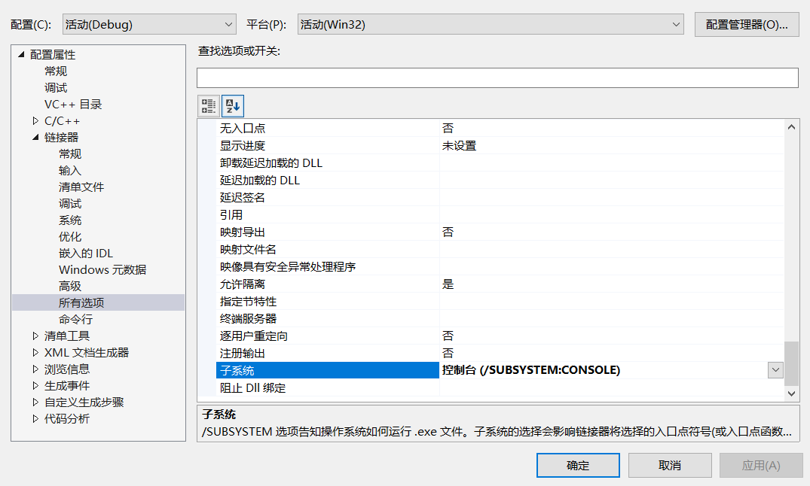
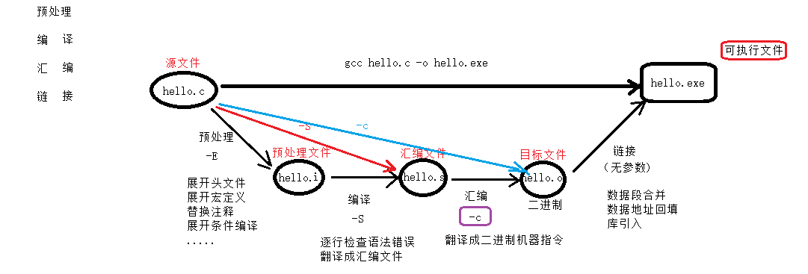

# day1

解决提示窗一闪而过：

```c
1. 通过 system()函数解决：

	在 return 0；之前添加 system("pause"); 
```

2. 借助VS工具解决：



单行注释：//	
	
多行注释：/* 注释内容 */ 

```c
多行注释不允许嵌套使用。 多行中可嵌套单行。
```

system 函数：

	执行系统命令。如： pause、cmd、calc、mspaint、notepad.....
	
	system("cmd");  
	
	system("calc");
	
	清屏命令：system("cls");

**gcc编译4步骤：**



### 1. 预处理		

**gcc -E xxx.c -o xxx.i**      **.i  预处理文件**

```c
	1) 头文件展开。 --- 不检查语法错误。 可以展开任意文件。

	2）宏定义替换。 --- 将宏名替换为宏值,宏函数替换。

	3）替换注释。	--- 变成空行

	4）展开条件编译 --- 根据条件来展开指令。
```
### 2.编译		

**gcc -S hello.i -o hello.s**		**.s  汇编文件**

```c
	1）逐行检查语法错误。【重点】	--- 整个编译4步骤中最耗时的过程。

	2）将C程序翻译成 汇编指令，得到.s 汇编文件。
```
### 3.汇编		

**gcc -c hello.s -o hello.o** 	**.o  目标文件**

```c
翻译：将汇编指令翻译成对应的 二进制编码。
```
4. ### 链接		

	**gcc  hello.o -o hello.exe**
```c
    1）数据段合并

	2）数据地址回填

	3）库引入
```

调试程序：

```c
添加行号：

	工具-->选项 --> 文本编辑器--> C/C++ -->行号 选中。

1. 设置断点。F5启动调试

2. 停止的位置，是尚未执行的指令。

3. 逐语句执行一下条 （F11）：进入函数内部，逐条执行跟踪。

3. 逐过程执行一下条 （F10）：不进入函数内部，逐条执行程序。

4. 添加监视：

	调试 --> 窗口 --> 监视：输入监视变量名。自动监视变量值的变化。
```

