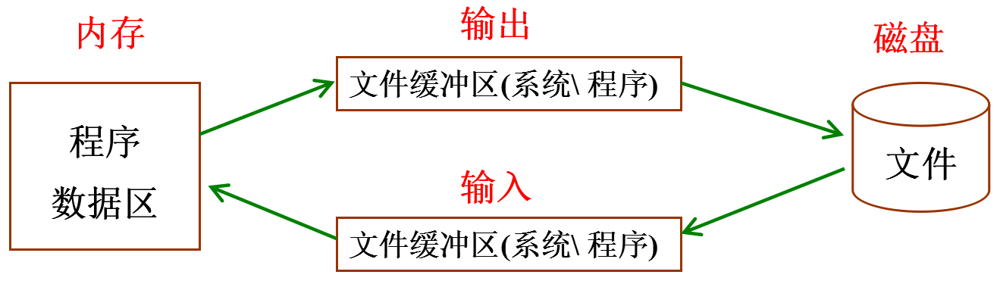

## 3)按格式化文件读写函数


```c
变参函数--(格式匹配符号)：参数形参中 有“...”, 最后一个参数是格式描述串（包含格式匹配符）， 函数的参数个数、类型、顺序由这个固参决定。
```
```
printf("%d = %d%c%d\n", 10+5, 10, '+', 5);		-->stdin中
```

```c
char buf[1024];   //缓冲区  

sprintf(buf, "%d = %d%c%d\n", 10+5, 10, '+', 5);		--> buf 中
```
```c
FILE * fp = fopen();

fprintf(fp, "%d = %d%c%d\n", 10+5, 10, '+', 5);			--> fp 对应的文件中
```


```c
scanf("%d", &m);		键盘 --> m
```


```c
char str[] = "98";

sscanf(str, "%d", &m);		str --> m
```


```c
FILE * fp = fopen("r");

fscanf(fp, "%d", &m);		fp指向的文件中 --> m
```

### fprintf()函数：

```c
int fprintf(FILE * stream, const char * format, ...);

功能：根据参数format字符串来转换并格式化数据，然后将结果输出到stream指定的文件中，指定出现字符串结束符 '\0'  为止。

	成功：实际写入文件的字符个数
	
    失败：-1
```

### fscanf()函数：

> 遇到空格 换行结束；

```c
int fscanf(FILE * stream, const char * format, ...);

	成功：正确匹配的个数。

	失败： -1

1) 边界溢出。 存储读取的数据空间。在使用之前清空。(循环读变量)

2）fscanf函数，每次在调用时都会判断下一次调用是否匹配参数2， 如果不匹配提前结束读文件。（feof(fp) 为真）。
```

**练习：文件版排序**

	生成随机数，写入文件。将文件内乱序随机数读出，排好序再写回文件。

## 4)按数据块文件读写函数

### fwrite()函数:		

> 既可写出数据到文本文件。也写出数据到二进制文件。

```c
size_t fwrite(const void *ptr, size_t size, size_t nmemb, FILE *stream);

	参1：待写出的数据的地址

	参2：待写出数据的大小

	参3：写出的个数				-- 参2 x 参3 = 写出数据的总大小。

	参4：文件

	返回值： 成功：实际成功写入文件数据的块数目，此值和参3相等。 
                        --- 通常将参2传 1，将参3传 实际写出字节数。

		    失败：0 
```

### fread()函数：

> 从文件fp中读出数据。

```C
size_t fread(void *buf, size_t size, size_t nmemb, FILE *stream);

	参1：读取到的数据存储的位置(缓冲区)
           
          缓冲区：代表一次读取数据的大小，类型任意，一般使用char

	参2：一次读取的字节数

	参3：读取的次数				-- 参2 x 参3 = 读出数据的总大小

	参4：文件

	返回值： 成功：参数3.	--- 通常将参2 传 1. 将参3传欲读出的字节数。				

		    失败：0.       --- 到达文件结尾 -- feof(fp)为真。 
```

练习：大文件拷贝

```c
已知一个任意类型的文件，对该文件复制，产生一个相同的新文件。

注意： 在windows下，打开二进制文件（mp3、mp4、avi、jpg...）时需要使用“b”。如：“rb”、“wb”
```


# 文件读写指针操作

> 文件读写指针。在一个文件内只有一个。

```c
fseek(): --->设置文件读写指针位置

	int fseek(FILE *stream, long offset, int whence);

		参1：文件

		参2：偏移量（矢量： + 向后， - 向前）

		参3：SEEK_SET：文件开头位置

			SEEK_CUR：当前位置

			SEEK_END：文件结尾位置

	返回值： 成功：0， 失败： -1
```
```c
ftell():

	获取文件读写指针位置。

	long ftell(FILE *stream);

	返回：从文件当前读写位置到起始位置的偏移量。
        
    借助  fseek(fp, 0, SEEK_END)    ftell(fp)  来获取文件大小。
```

```c
rewind():

	回卷文件读写指针。 将读写指针移动到起始位置。

	void rewind(FILE *stream);
```


### Linux和windows文件区别：

```c
1）对于二进制文件操作， Windows 使用“b”， Linux下二进制和文本没区别。
 
2)Linux下所有的文本文件行都是\n结尾，而Windows所有的文本文件行都是\r\n结尾    

2）windows下，当读取文件的时候，系统会将所有的 "\r\n" 转换成 "\n"
            ,当写入文件的时候，系统会将 "\n" 转换成 "\r\n" 写入 .
   	         	
  Linux下 回车换行\n

3) 对文件指针，先写后读。windows和Linux效果一致。
   
    先读后写。Linux无需修改。windows下需要在写操作之前添加 fseek(fp, 0, SEEK_CUR); 来获			
    		取文件读写指针，使之生效。        
```

### 获取文件状态：

> 打开文件操作，对于系统而言，系统资源消耗较大。

```c
int stat(const char *path, struct stat *buf);

	参1： 访问文件的路径

	参2： 文件属性结构体

	返回值： 成功： 0， 失败： -1；
```


删除、重命名文件：

```c
int remove(const char *pathname); 删除文件。

int rename(const char *oldpath, const char *newpath);  重名文件
```

#### 缓冲区刷新：



```c
stdout->标准输出缓冲区。写给屏幕的数据，都是先存缓冲区中，由缓冲区一次性刷新到物理设备（屏幕）

stdin ->标准输入缓冲区。从键盘读取的数据，直接读到缓冲区中， 由缓冲区给程序提供数据。

预读入、缓输出。

行缓冲：printf(); 遇到\n就会将缓冲区中的数据刷新到物理设备上。

全缓冲：文件。 缓冲区存满， 数据刷新到物理设备上。

无缓冲：perror。 缓冲区中只要有数据，就立即刷新到物理设备。
```


文件关闭时， 缓冲区会被自动刷新。  隐式回收：关闭文件、刷新缓冲区、释放malloc

```c
手动刷新缓冲区函数

	int fflush(FILE *stream);

		成功：0

		失败：-1
```
