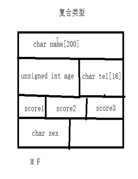

## 复合类型

### **结构体定义及赋值**

1、复合类型在内存中存放的模型：


2、定义**结构体变量**格式： 

```c
struct  变量名 (结构体名称) ｛   结构体成员列表   ｝ ；

struct man
{
	char name[100]; -->只能声明
	int age;
}; 

struct man
{
	char name[100]; 
	int age;
}a={ "tom", 12 },b; 

struct 
{
	char name[100]; 
	int age;
}a,b; 
```


3、访问结构体表述格式：

```c
普通元素 .  访问

有效指针（有指向内存，非野指针）-> 访问

&变量名->  或 （*p）  .  访问

. 的优先级比 * 高 所以需要加括号
```

##### **结构体变量**

##### **结构体数组**

```c
struct student {
	int age;
	char name[10];
	int num;
};

struct student arr[5] = {
		{ 10, "andy", 10 },
		{ 11, "lucy", 11 },
		{ 12, "lily", 12 },
		{ 13, "mike", 13 },
		{ 14, "marry", 14 }
	};
```

##### **结构体指针**

```c
struct student *stu1 = {15, "ABC", 67, 99};

struct student  stu2 = {15, "ABC", 67, 99};

struct student  *p=&stu2;
```

**结构体数组做参数，结构体指针做参数。**


一、定义结构体类型指针
1）指向栈空间
2）指向堆空间

字符串指针

```c
struct  man *p;
1） char *p;     //字符指针指向字符常量首元素地址
      p=" mike";

2) char *p;     //字符指针指向栈空间
     char buf[100];
    p=buf;
   strcpy(p,"mike");//往p所指向空间拷贝内容

3）char *p;
     p=(char *)malloc(strlen("mike")+1);
   strcpy(p,"mike");
```

二、结构体套一级指针

```c
struct man
{
	char* name; 
	int age;
}; 

  struct  man obj;
1） 
      obj.name=" mike";
2) 
     char buf[100];
     obj.name=buf;
     strcpy(p->name,"mike");//往name所指向空间拷贝内容
3）
     obj.name=(char *)malloc(strlen("mike")+1);
    strcpy(p,"mike");

结构体套一级指针 变量为指针-》二级指针
```


### 联合体（共用体）

> 同一个存储空间存储不同类型数据的类型；

1.联合体（共用体）的大小是**最大数据类型成员**的大小的倍数,且需放下**最大成员**。(内存对齐 )
2.共用体公用一块内存，所有成员地址相同
3.给某个成员赋值，会影响到另外的成员
   左边是高位，右边是低位。
   高位放高地址，低位放低地址（小端） 用十六进制赋值验证

4.共用体变量中起作用的成员是最后一次存放的成员，在存入一个新的成员后原有的成员的值会被覆盖；

### 枚  举：         

```c
enum  color { 枚举常量1，枚举常量2 ... };    enum  color  -> 枚举类型

enum  color { red, green, blue, black, pink, yellow };

枚举常量(枚举成员): 是整型常量。不能是浮点数。可以是负值。 默认初值从 0 开始，后续常量较前一个常量 +1.

可以给任意一个常量赋任意初值。后续常量较前一个常量 +1
```
enum Color flag；

枚举变量
可以给枚举变量赋值
flag=red；


### typedef

给一个数据类型起一个别名，不能创建新的类型。

如：

typedef struct man
{
	char name[100]; 
	int age;
}Man; 
Man obj；