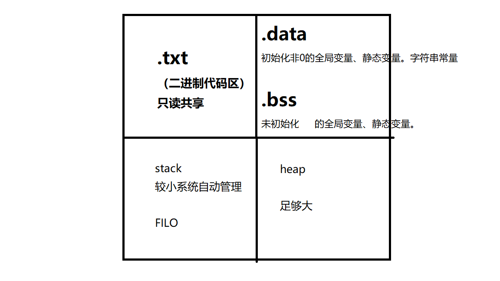

## 数据类型

**数据类型基本概念：**

数据类型是为了更好进行内存的管理,让编译器能确定**分配**多少**内存**。

类型是对数据的抽象;  

类型相同的数据具有相同的表示形式、存储格式以及相关操作;  

程序中所有的数据都必定属于某种数据类型;  

数据类型可以理解为创建变量的模具: **固定大小内存的别名**;  

#### typedef使用

1. 数据类型起别名 -  简化结构体关键字
2. 区分数据类型
3. 提高代码移植性 

#### void使用

1. 不可以利用void创建变量 ,无法给无类型变量分配内存
2. 用途：限定函数返回值，限定函数参数类型
3. void * 万能指针  可以不通过强制类型转换就转成其他类型指针 ，其他类型指针转成其他类型指针必须通过    强转

#### sizeof用法

1. 本质：不是一个函数，是一个**操作符**
2.	返回值类型 unsigned int无符号整型
3.	 用途：可以统计数组长度

#### 变量的修改方式

1. 直接修改
2. 间接修改
3. 结构体数据类型修改

## 内存分区



1. **运行前**
   (1)	代码区(.txt)   只读
   (2)	数据区   存放数据：**全局变量** 、**静态变量**、**常量**

   ```mermaid
   graph LR
   已初始化数据区===.data
   未初始化数据区===.bss
   
   
   ```

2.  **运行后**
   (1)	栈   符合先进后出数据结构，编译器自动管理分配和释放，有限容量
   (2)	堆   容量远远大于栈。手动开辟 malloc 手动释放 free

全局、静态区内的变量在编译阶段已经分配好内存空间并初始化。这块内存在程序运行期间一直存在,它主要存储**全局变量**、**静态变量**和**常量**。

### 栈区

1. 符合先进后出数据结构
2. **注意事项：**不要返回局部变量的地址，局部变量在函数执行之后就被释放了，释放的内存没有权限取操作，如果操作结果未知 (往往初次操作正常，二次操作乱码)

### 堆区

1. 利用malloc在堆区创建数据

2. 利用free释放堆区

3. 注意事项：主调函数没有分配内存，被调函数需要用**更高级的指针**去修饰低级指针，进行分配内存

   

**堆内存分配函数**

```#include <stdlib.h>```

   ```c
   void *calloc(size_t nmemb,size_t size);
   功能：在内存中分配nmemb块长度为size字节的连续区域。
         与malloc不同的是，calloc会将空间初始化为0.
   
   返回值：
   	成功：分配空间的起始地址
       失败：NULL
   ```
 ```c   
   void *realloc(void *ptr, size_t size);
   功能：
   重新分配用malloc或者calloc函数在堆中分配内存空间的大小。
   realloc不会自动清理增加的内存，需要手动清理，如果指定的地址后面有足够的的空间，那么就会在已有地址基础上增加内存，如果指定的地址后面没有足够的空间，那么realloc会重新分配新的连续内存，把旧内存的值拷贝到新内存，同时释放旧内存。
   参数：
   ptr：为之前用malloc或者calloc分配的内存地址，如果此参数等于NULL，那么和realloc与malloc功能一致
   size：为重新分配内存的大小, 单位：字节
  
       返回值：
   成功：新分配的堆内存地址
   失败：NULL
       
 
 1. 先看后续空间，如果足够，那么直接扩展
 
 2. 如果后续空闲空间不足，那么申请足够大的空间，将原有数据拷贝到新空间下，释放掉原有空间，将新空间的首地址返回
 
 3. 如果重新分配的内存比原来小，那么释放后序空间，只有权限操作申请空间
 ```

### 全局/静态区（（（数据段）

全局/静态区内的变量在编译阶段已经分配好内存空间并初始化。这块内存在程序运行期间一直存在,它主要存储**全局变量**、**静态变量**和**常量**。

#### static 

特点：在运行前分配内存，程序运行结束 生命周期结束  ，在本文件内都可以使用

#### extern

extern 可以提高变量作用域，外部链接属性，表示变量在其他文件中.

​               (在C语言下 ,全局变量前都隐式加了关键字 extern）

#### 常量

1. **const修饰的变量**
   (1)==全局常变量==  **直接**修改 **失败** ， **间接**修改 语法通过，运行**失败**，受到常量区保护。 存放于==静态常量区==中。
   (2)==局部常变量==    **直接**修改 **失败** ， **间接**修改  **成功**，存放放在==栈==上
   
   全局或静态常变量不可修改。
   
2. **字符串常量**

   1. 不可以修改字符串常量，ANSI并没有制定出字符串是否可以修改的标准，根据编译器不同，可能最终结果也是不同的
   2. vs 相同字符串常量地址相同，QT相同文件地址相同，不同文件不同。

