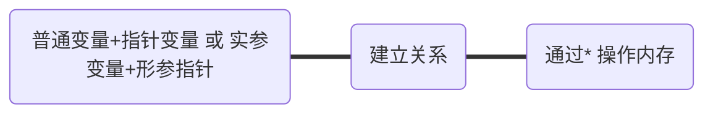

### 宏函数

```#define  MYADD(x,y)  ((x) + (y)```

1. 将一些频繁短小的函数  写成宏函数
2.	宏函数优点：以空间换时间
3.	普通函数有入栈、出栈时间开销


### 函数调用流程
一个函数调用过程所需要的信息一般包括以下几个方面：

函数的返回地址（记录调用处地址）；函数形参；局部变量；


### 调用惯例

1. **主调函数**和**被调函数**必须要有**一致**约定，才能正确的调用函数，这个约定我们称为调用惯例
2. 调用惯例 包含内容： 出栈方、参数传递顺序、函数名称修饰
3. C/C++下默认调用惯例： cdecl   从右到左 ，z主调函数管理出栈


### 栈的生长方向和内存存放方向

1. 栈生长方向  栈底  ---  高地址 栈顶  ---  低地址
2. 内存存放方向  高位字节数据  ---  高地址 低位字节数据  ---  低地址  小端对齐方式

### 指针

#### 空指针和野指针

不能向NULL或者**非法内存**拷贝数据

**野指针**
1.指针变量未初始化
2.指针释放后未置空
3.指针操作超越变量作用域

**空指针可以重复释放、野指针不可以重复释放**


**指针的步长**

1. +1之后跳跃的字节数

2. 解引用 解出的字节数

**练习自定义结构体做步长练习**
   （1）通过 offsetof( 结构体名称， 属性)  找到属性对应的偏移量
   （2）offsetof 引入头文件 #include<stddef.h>


**指针的间接赋值**

**三大条件**



**练习：利用Qt实现 操作地址  修改内存**


#### 指针做函数参数的输入输出特性

**输入特性**

1. 在主调函数中分配内存，被调函数使用  **分配在栈上和堆区**   	
2. 输出特性   被调函数分配内存，主调函数使用    **分配在堆区**


### 字符串强化训练

1. 字符串结束标志 \0

2. sizeof 和 strlen 

      sizeof  计算数据占空间大小，strlen 到\0长度

     \0dd d为(0-7) 数字    \xdd d为(0-f)数字

3. **拷贝字符串 利用三种方式**
     (1)利用[]
     (2)利用指针
     (3)while (*dest++ = *src++){}
4. **翻转字符串**
     (1)利用[ ]
     (2)利用指针

### sprintf使用

```c
int sprintf(char *dst, const char *format, ...);
参数： 
	dst：字符串首地址
	format：字符串格式，用法和printf()一样
返回值：
	成功：实际格式化的字符串长度
	失败： - 1
```

