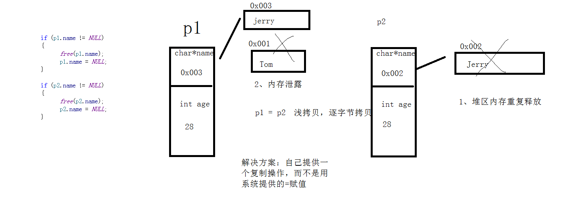

### 一维数组名
1. 除了三种特殊情况外，一维数组名的值是一个**指针常量**，也就是指向数组第一个元素的指针。
   (1)特殊情况1   sizeof 统计数组长度
   (2)特殊情况2   对数组名取地址为**数组指针**，步长为整个数组长度
   (3)特殊情况3  对数组名**直接进行**++  ，代表数组指针 步长为整个数组长度。
   
2. 数组名是指针常量，指针的指向不可以修改的，而指针指向的值可以改

3. 一维数组传参数时候用  int arr[]  可读性更高

4. 数组索引下标可以为负数

**数组和指针区别**

声明一个**数组**时，编译器根据声明所指定的元素数量为数组**分配内存空间**，然后再创建数组名，指向这段空间的起始位置。

声明一个**指针**变量的时候，编译器**只为指针本身分配内存空间**，并不为任何整型值分配内存空间，指针并未初始化指向任何现有的内存空间。


### 数组指针的定义方式

1. 先定义出数组类型，再通过类型定义数组指针变量

```c
typedef int(ARRARY_TYPE)[5];      ARRARY_TYPE 代表 存放5个int类型元素数组  的数组类型
```

2. 先定义数组指针类型，再通过类型定义数组指针变量

   ```c
   typedef int(*ARRARY_TYPE)[5];  ARRARY_TYPE 代表 指向存放5个int类型元素数组  的指针类型
   ```

3. 直接定义数组指针变量  ```int(* p )[5] = &arr;```

### 二维数组名

> **二维数组具有的线性存储特性**

1. 二维数组名 除了两种特殊情况外，是指向第一个一维数组的 数组指针

2. 三种特殊情况
   （1）sizeof 统计二维数组大小
   （2）对数组名称取地址   &arr  -> 获取的是二维数组的 数组指针 即**指向第一个一维数组的指针**
     (3)  对数组名**直接进行**++  ，代表数组指针 步长为一个一维数组的长度。
   
3. 二维数组做函数参数

```c
void printArray(int (*array)[3], int row, int col)

void printArray(int array[][3], int row ,int col)

void printArray(int array[3][3], int row ,int col)  可读性比较高
```
4. 数组指针  和  指针数组

   ```mermaid
   graph LR
   数组指针:指向数组的指针
   指针数组:由指针组成数组 
   ```

### 指针数组排序

**1.选择排序**
2.利用选择排序实现 指针数组 从大到小排序


### 结构体基本概念

1. typedef给结构体起别名

2. 直接创建一个结构体变量

3. 匿名结构体  

**练习**
(1)在栈上创建和在堆区创建结构体
(2)在栈上和堆区创建结构体变量数组




### 结构体嵌套

结构体可以嵌套 另外一个结构体;

结构体不可以嵌套**本结构体**。 类型大小不能确定。

结构体嵌套可以嵌套  **本结构体指针变量**。 指针变量的类型大小能确定。

### 结构体深浅拷贝

1. 系统提供的赋值操作是    浅拷贝 – 简单值拷贝，逐字节拷贝

2. 如果   **结构体指针、结构体中的指针**  创建在堆区，就会出现问题，在释放期间，一段内存重复释放，一段内存泄露

   ​              **-->指针不能创建在堆区**

3. 解决方案：自己手动去做赋值操作，提供深拷贝


### 结构体嵌套一级指针练习

1. 在堆区创建一个 结构体指针数组   ``` malloc(sizeof(struct Person *) *3 )```
2. 在堆区创建出结构体变量     ```malloc(sizeof(struct Person))```
3. 	在堆区创建出具体姓名  ```malloc(sizeof(char )*64)；```
4. 打印数据
5. 释放数组