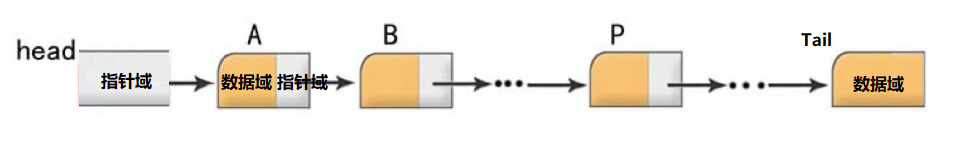
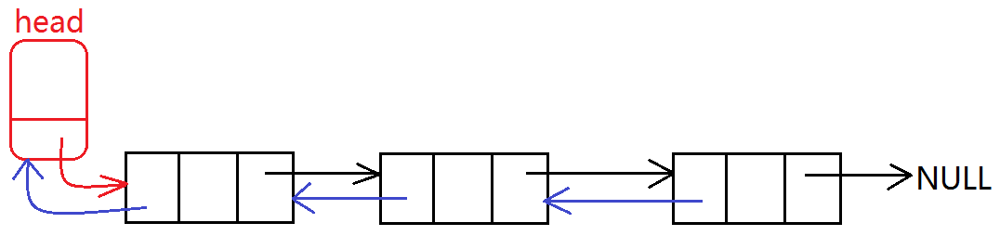
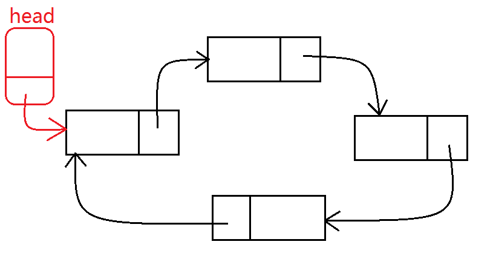

**引出- 数组缺陷**

1. 数组是一个静态空间，一旦分配内存，就不可以动态扩展，空间可能分配多或者分配的少，操作不精准
2. 删除插入 某个元素效率低（尤其头元素）



### 链表

1. 由节点组成

2. 而节点由  数据域  和  指针域组成
      (1) 数据域是维护数据的
      (2) 指针域 维护下一个节点的位置
      
3. 链表的分类
 (1)静态链表、动态链表
    (2)带头链表、不带头链表。 

  (3)单向链表、双向链表、单向循环链表、双向循环链表

**双向**




**循环**




**静态链表和动态链表**

1. 静态链表分配在栈上

2. 动态链表分配到堆区

3. 实现两种链表的初始化以及遍历功能

 

**带头节点链表和不带头节点链表**  

带头好处：带着头节点的链表永远固定了头节点的位置


### 链表基本使用

```c
1.初始化链表
struct LinkNode * initLinkList();

2.遍历链表
void foreach_LinkList(struct LinkNode * pHeader);

3.插入链表
void insert_LinkList(struct LinkNode * pHeader, int oldVal, int newVal);
void insert_LinkList(struct LinkNode * pHeader, int position);
4.删除链表
void delete_LinkList(struct LinkNode * pHeader, int val);
void delete_LinkList(struct LinkNode * pHeader, int position);

5.清空链表
void clear_LinkList(struct LinkNode * pHeader);

6.销毁链表
void destroy_LinkList(struct LinkNode * pHeader);
```

**练习：7. 翻转链表   8. 计算链表节点数     **


### 函数指针

1. 函数名本质就是一个函数指针
2. 可以利用函数指针 调用函数 

**函数指针定义方式**
1. 先定义出函数类型，再通过类型定义函数指针
```typedef void(FUNC_TYPE)(int, char);```
2. 定义出函数指针类型，通过类型定义函数指针变量
```typedef void( * FUNC_TYPE)(int, char);```
3. 直接定义函数指针变量
```void(*pFunc)(int, char) = func;```

**函数指针和指针函数**
**函数指针 :**指向了函数的指针
**指针函数 :**函数返回值是指针的函数


**函数指针数组**   ```void(*pArray[3])();```

```c
void func01(int a){
	printf("func01:%d\n",a);
}
void func02(int a){
	printf("func02:%d\n", a);
}
void func03(int a){
	printf("func03:%d\n", a);
}

void test(){

#if 1
	//定义函数指针
	void(*func_array[])(int) = { func01, func02, func03 };
#else
	void(*func_array[3])(int);
	func_array[0] = func01;
	func_array[1] = func02;
	func_array[2] = func03;
#endif

	for (int i = 0; i < 3; i ++){
		func_array[i](10 + i);
		(*func_array[i])(10 + i);
	}
}

```


### 函数指针做函数参数（回调函数）

1. 利用回调函数实现打印任意类型数据

   ```c
   void printText( void * data , void(*myPrint)(void *) );
   ```

2. 提供能够打印任意类型数组函数

   ```c
   void printAllArray(void * pArray , int eleSize, int len , void(*myPrint)(void*) );
   ```

3. 利用回调函数 提供查找功能

   ```c
   int findArrayEle(void * pArray, int eleSize, int len, void * data ,int(*myCompare)(void* ,void* ));
   ```

**练习：4. 提供一个函数，实现对任意类型的数组进行排序，排序规则利用选择排序，排序的顺序 用户可以自己指定        注意：字符串数组特殊，字符串数组传址为常量区 **